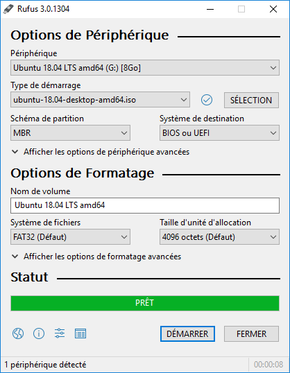

# USB Bootable

## Debian iso bootable on USB by Linux OS Command Line
- Type this command to check your USB Device:
```bash
$ lsblk
```
For example your device is mounted at **sdx**. 
- Type this command to unmount the drive
```bash
$ sudo umount /dev/sdx1
```
- Flash the iso file to usb drive
```bash
$ sudo dd bs=4M if=/path/to/debian.iso of=/dev/sdx status=progress oflag=sync
```
## Debian iso bootable on USB by Windows
- Download rufus, Go to download page:
```yaml
https://rufus.ie/
```
- Set configuration like this image : 
  

## Windows 10 iso bootable on USB in Linux OS
Source : https://itsfoss.com/bootable-windows-usb-linux/

- Open Disks(gnome-disks)
- Select USB and Click to **Format Disk**
- Set Partition to **MBR/DOS**
- Click **Format** Button
- After formating USB, **Create new partition**
- Click Next
- Set Type to **FAT**(*if your ISO file less than 4Gb*) or **ExFAT**(*if your ISO file greater than 4Gb*)
- To Finish, right click to Debian iso file, and click to **Open with Image mounter** and Follow the step